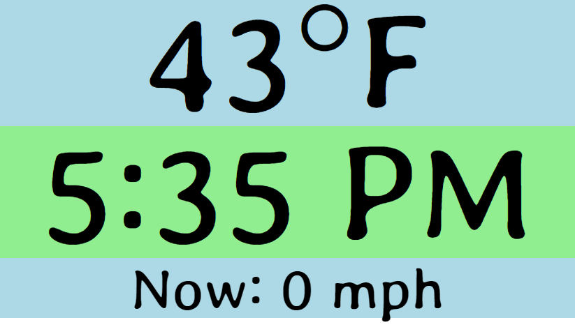

# Crandard
A WeeWX 'skin' for a small display; based on the "Standard" skin.

With thanks to Vince, "tke...", and others in the weewx-user Google group. :-)

This is a simple, easy-to-read "skin" for WeeWx, so that my wife and I can glance
at the display before we take our dog for a walk. It shows us what we want to
know, quickly. It shows

* The current temperature
* The current wind speed, and the peak wind speed in the most recent 30 minutes, alternating back and forth.
* Then, since I had more room, I added a few more things we might like to see.

The display is currently optimized for a Raspberry Pi with a 7-inch LCD display
attached (800 x 480 pixels).

The only files you need for your WeeWx installation are "skin.conf" and
"index.html.tmpl"; the others are project files.

Here's a screenshot of it in action. 

